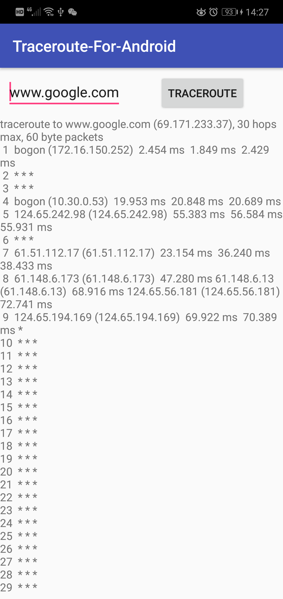

# traceroute-for-android [  ](https://bintray.com/angelwangjing/maven/traceroute-for-android/_latestVersion)
Easy way to use traceroute on Android.

## Description

Traceroute tracks the route packets taken from an IP network on their way to a given host. It utilizes the IP protocol's time to live (TTL) field and attempts to elicit an ICMP TIME_EXCEEDED response from each gateway along the path to the host.

## Rendering Image



## Adding to project

```groovy
dependencies {
    implementation 'com.wandroid:traceroute:<latest-version>'
}
```

## Simple usage

synchronous way

```kotlin
val traceResult = TraceRoute.traceRoute("www.google.com")
```

asynchronous way

```kotlin
TraceRoute.setCallback {
    success { Log.d("tag", "\ntraceroute finish") }
    update { text -> Log.d("tag", text) }
    failed { code, reason -> Log.d("tag", """\ntraceroute failed.code:$code, reason:$reason""") }
}
TraceRoute.traceRoute("www.google.com", true)
```

## Proguard

```proguard
-keepclassmembers com.wandroid.traceroute.TraceRoute {
    void clearResult();
    void appendResult(***);
    int execute(***);
}
```

get executable file from [traceroute-android-executable](https://github.com/wangjing53406/traceroute-android-executable)

## License

This project is licensed under the terms of the Apache License 2.0 license.